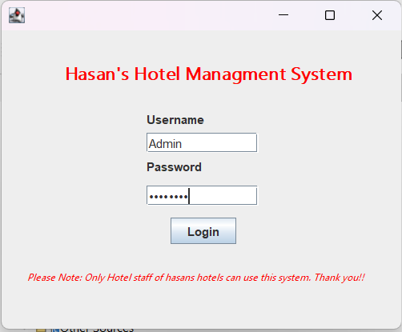
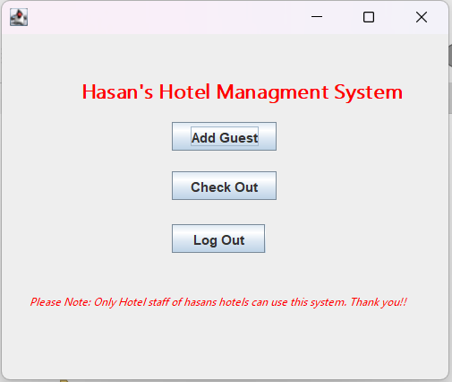
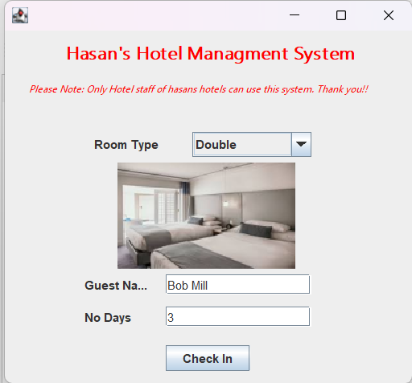
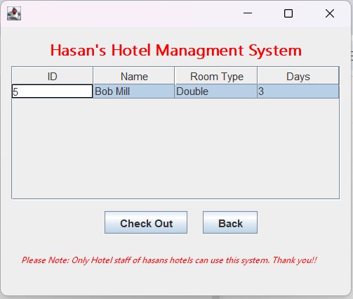

<h1>Hotel Management System</h1>

<h2>Overview</h2>

This is a <strong>Java-based Hotel Management System</strong> with a GUI built in NetBeans. I made it so that a hotel manager or receptionist can add check there guests in and out of a room with it but they have to do it with a admin username and passowrd and then they can keep an eye on who is where and then if someone leaves a room they can also check them out. I also used mySQL to store all the info and link back to it from the application itself

<h3>Features:</h3>
<ul>
    <li>Admin login</li>
    <li>Add guests and check them in</li>
    <li>Select room types (Single, Double, Suite) and view room images</li>
    <li>Check guests out</li>
    <li>Track room availability (5 rooms per type)</li>
    <li>Generates a PDF receipt after check-in</li>
</ul>

<h3>Technologies used:</h3>
<ul>
    <li>Java Swing (GUI)</li>
    <li>MySQL database</li>
    <li>iText library for PDF generation</li>
    <li>Images for room visualization</li>
</ul>

<h2>Database Setup</h2>

Create the database <code>hotel_db</code> and the following tables in MySQL:

<h3>Rooms Table</h3>
<pre><code>CREATE TABLE rooms (
    room_type VARCHAR(50) PRIMARY KEY,
    available_count INT,
    price INT,
    image_path VARCHAR(255)
);

INSERT INTO rooms VALUES ('Single', 5, 50, 'images/single.jpg');
INSERT INTO rooms VALUES ('Double', 5, 80, 'images/double.jpg');
INSERT INTO rooms VALUES ('Suite', 5, 150, 'images/suite.jpg');</code></pre>

<h3>Guests Table</h3>
<pre><code>CREATE TABLE guests (
    id INT AUTO_INCREMENT PRIMARY KEY,
    name VARCHAR(100),
    room_type VARCHAR(50),
    days INT
);</code></pre>

<h3>Users Table</h3>
<pre><code>CREATE TABLE users (
    username VARCHAR(50),
    password VARCHAR(50)
);

INSERT INTO users VALUES ('admin', 'admin');</code></pre>

<h2>How to Run</h2>
<ol>
    <li>Clone the repository:
        <pre><code>git clone https://github.com/hasanbodhania/HotelManagementSystem.git</code></pre>
    </li>
    <li>Open the project in <strong>NetBeans</strong>.</li>
    <li>Update <code>DB.java</code> with your MySQL password:
        <pre><code>return DriverManager.getConnection(
    "jdbc:mysql://localhost:3306/hotel_db",
    "root",
    "This is where you put whatever your password is LOL, (DON'T LEAVE AS IT IS OR IT WILL NOT WORK!!!!!"
);</code></pre>
    </li>
    <li>Run <code>Login.java</code> to start the application.</li>
</ol>

<h2>Screenshots</h2>

<h2>How It Works</h2>
<h3>1. Login</h3>

Enter username and password (<code>admin/admin</code> by default).

<h3>2. Main Menu</h3>

Navigate to:

<ul>
    <li>Add Guest</li>
    <li>Check Out</li>
    <li>Log Out</li>
</ul>

<h3>3. Add Guest</h3>
<ul>
    <li>Select a room type (Single, Double, Suite)</li>
    <li>Enter guest name and number of nights</li>
    <li>See the room image update automatically</li>
    <li>Click <strong>Check In</strong> → room availability decreases → PDF receipt is generated</li>
</ul>

<h3>4. Check Out</h3>
<ul>
    <li>Select a guest from the table</li>
    <li>Click <strong>Check Out</strong> → guest removed → room availability increases</li>
</ul>

<h2>Skills Demonstrated</h2>
<ul>
    <li>Java Swing GUI design</li>
    <li>Database connection and SQL queries</li>
    <li>Dynamic GUI updates (room images, table refresh)</li>
    <li>Handling availability constraints</li>
    <li>PDF generation for receipts</li>
</ul>

<h2>Author</h2>

<strong>Hasan Bodhania</strong> 
Email: hasanbodhania@gmail.com 
Phone: 07878 253584

